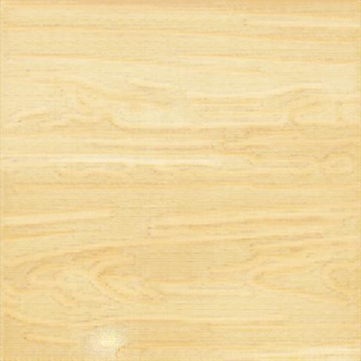

# pix2texture

The project pix2texture is a tool to generate realistic textures using as input plain pictures with black lines. This algorithm is based on the project Pix2Pix.

## Examples

- Texture generation from plain drawings

<table>
<tr>
  <th scope="col">Input</th>
  <th scope="col">Output</th>
</tr>
<tr>
  <td></th>
  <td></th>
</tr>
<tr>
  <td></th>
  <td></th>
</tr>
<tr>
  <td></th>
  <td></th>
</tr>
</table>

- Photos contour in textures

<table>
<tr>
  <th scope="col">Original</th>
  <th scope="col">Input</th>
  <th scope="col">Output</th>
</tr>
<tr>
  <td></th>
  <td></th>
  <td></th>
</tr>
</table>

- Other cool random stuff

<table>
<tr>
  <th scope="col">Original</th>
  <th scope="col">Input</th>
  <th scope="col">Output</th>
</tr>
<tr>
  <td></th>
  <td></th>
  <td></th>
</tr>
<tr>
  <td></th>
  <td></th>
  <td></th>
</tr>
</table>

## Requirements

- Linux
- Docker

## Getting Started

### Dataset

Download the dataset from [here](https://mega.nz/#!tckWmSAD!gu6xiASnKw6HFYcrNNDxSMBVyVPItmYCl63ZIwJG1Gk) and place the "data" folder somewhere in your computer.

### Installation

Just run the following command replacing the data directory with yours

```bash
sudo docker run -it --runtime=nvidia -v /my/data/path:/tf/notebooks/data -p 8888:8888 --name pix2texture frantracer/pix2texture
```

Copy the provided URL into your browser to launch jupyter notebooks.

In case you do not have GPU acceleration enabled for docker, check the appendix for further information about how to install it, or just run the following command:

```bash
sudo docker run -it -v /my/data/path:/tf/notebooks/data -p 8888:8888 --name pix2texture frantracer/pix2texture
```

If you close the container or it stops, run the following command to restart it:

```bash
sudo docker start -i pix2texture
```

### Preprocessing

The preprocessor generates several images from a given one, looking for the main edges and putting then over a plain background with the mean color of the image.

To launch the preprocessor you have to access the container, so launch:

```bash
sudo docker exec -it pix2texture /bin/bash
```

Then you can run the preprocessor to generate a training set from a set of images. Place the images you want to convert in the "data/original/mydataset/myclass" directory and run the following command:

```bash
python3 preprocessor.py --input-path ./notebooks/data/original --output-path ./notebooks/data/training/input --subdirs mydataset
```

**IMPORTANT** : Do not forget the "myclass" subdirectory, it is not used yet but it will be used for the cGAN

There are plenty of options to change the size, color and line thickness of the output images, so check the help for further information.

```bash
python3 preprocessor.py --help
```

### Training

By default there will be a model loaded in the docker container.

But in case you want to train with your dataset, you can execute all the cells within the jupyter "main.ipynb" file.

Or, in the bash you launched earlier, write:

```bash
python3 main.py --training-input ./notebooks/data/training/input/mydataset --training-output ./notebooks/data/training/output/mydataset --checkpoints-path ./notebooks/checkpoints/ --skip-evaluation
```

Once the training is over it will generate a checkpoint that will be used in future trainings or evaluations, so do not forget to remove everything if you want a clean start.

### Evaluating

In the notebook by default the evaluation step will be launched after the training is finished.

You can do the same as the training and launch only the evaluation step in the bash:

```bash
python3 main.py --evaluation-input ./notebooks/data/evaluation/input/other --evaluation-output ./notebooks/data/evaluation/output/other --checkpoints-path ./notebooks/checkpoints/ --skip-training
```

Every file in the input directory will be evaluated and the prediction placed in the output directory.

## Development

For development purposes it is recommended to download the repository

```bash
git clone frantracer/pix2texture
cd pix2texture
```

and run the application sharing the source code with the container:

```bash
sudo docker run -it -u $(id -u):$(id -g) --runtime=nvidia -v $(pwd):/tf -p 8888:8888 frantracer/tensorflow-2-gpu:cuda-10.1
```

To publish the docker image run:

```bash
sudo docker build . -t frantracer/pix2texture:latest --no-cache
sudo docker push frantracer/pix2texture:latest
```

Another useful command to generate python scripts from the notebook is:

```bash
jupyter nbconvert --to script notebooks/main.ipynb --TagRemovePreprocessor.remove_cell_tags='{"info_cell"}' --no-prompt --output-dir .
```

## Future work

- Generate a cGAN to be able to train different textures, like clouds, water, stone or earth.
- Implement pix2pixHD to generate bigger textures

## References

- [Pix2Pix Paper](https://arxiv.org/pdf/1611.07004.pdf)
- [Face aging with cGAN Paper](https://arxiv.org/pdf/1702.01983.pdf)
- [Dot CSV GAN implementaiton video](https://www.youtube.com/watch?v=YsrMGcgfETY)
- [cGAN implementation Article](https://iq.opengenus.org/face-aging-cgan-keras/)

## Appendix

### Enable GPU accelation whithin docker

Uninstall older versions of docker if any:

```bash
sudo apt-get remove docker docker-engine docker.io containerd runc
```

Install latest version of docker

```bash
sudo apt update
sudo apt install \
    apt-transport-https \
    ca-certificates \
    curl \
    gnupg-agent \
    software-properties-common

curl -fsSL https://download.docker.com/linux/ubuntu/gpg | sudo apt-key add 
sudo add-apt-repository \
   "deb [arch=amd64] https://download.docker.com/linux/ubuntu \
   $(lsb_release -cs) \
   stable"
sudo apt update
sudo apt install docker-ce docker-ce-cli containerd.io

distribution=$(. /etc/os-release;echo $ID$VERSION_ID)
curl -s -L https://nvidia.github.io/nvidia-docker/gpgkey | sudo apt-key add -
curl -s -L https://nvidia.github.io/nvidia-docker/$distribution/nvidia-docker.list | sudo tee /etc/apt/sources.list.d/nvidia-docker.list
```

Install nvidia-docker and restart docker

```bash
sudo apt update && sudo apt-get install -y nvidia-container-toolkit
sudo apt install nvidia-docker2
sudo systemctl restart docker
```
